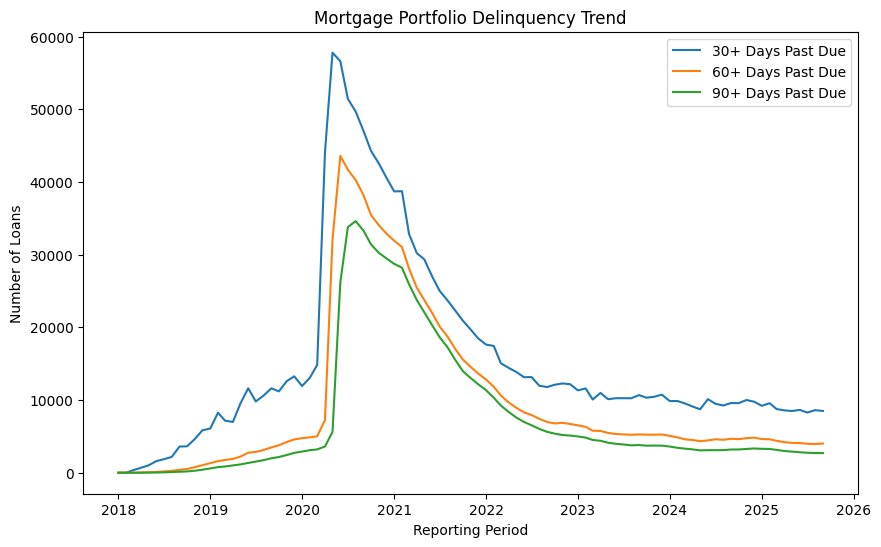
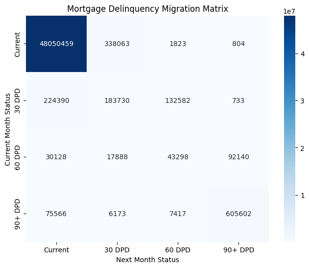
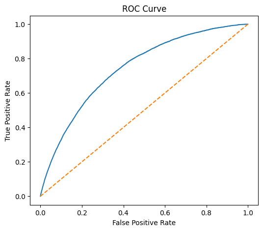
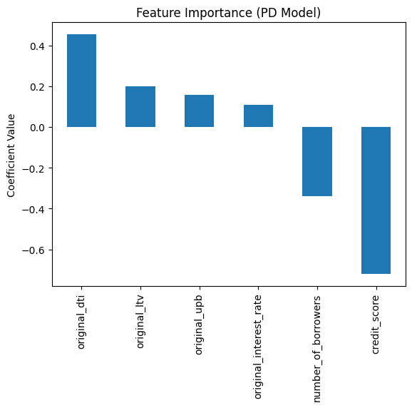

# Mortgage Credit Risk Analytics with Freddie Mac Dataset

This project builds an end-to-end mortgage credit risk analytics pipeline using the Freddie Mac Single-Family Loan Level Dataset.

The workflow combines **AWS data engineering, portfolio risk analytics, and machine learning** to estimate mortgage default risk.

---

# Dataset

Freddie Mac Single-Family Loan Level Dataset

Scope used in this project:

- ~1.2 million mortgage loans
- ~$297B total loan exposure
- Monthly loan performance history
- Origination borrower and loan characteristics

---

# Project Architecture

The project follows a modular workflow similar to real credit risk analytics pipelines.

Raw Mortgage Data (Origination + Performance)
↓
AWS Athena Data Engineering
↓
Loan Performance Panel Dataset
↓
Portfolio Risk Analytics
↓
Probability of Default (PD) Model
↓
Expected Loss Estimation

---

# Technologies Used

- **AWS S3**
- **AWS Athena**
- **Python**
- **Pandas**
- **Scikit-learn**
- **Matplotlib / Seaborn**

---

# Portfolio Risk Analytics

## Delinquency Trend

Tracking the evolution of delinquency levels across the mortgage portfolio.

---

## Delinquency Migration Matrix

Transition analysis between delinquency states.

---

# Probability of Default Model

A logistic regression model (trained using SGD) estimates the probability that a loan defaults within the next 12 months.

Features used include:

- Credit Score
- Loan-to-Value (LTV)
- Debt-to-Income (DTI)
- Interest Rate
- Loan Balance
- Number of Borrowers

---

# Model Performance

| Metric | Value |
|------|------|
ROC-AUC | **0.74**
KS Statistic | **0.36**

---

# Model Interpretation

Feature importance analysis shows relationships consistent with credit risk theory.

- Higher **DTI and LTV increase default risk**
- Higher **credit scores reduce default risk**

---

# Credit Risk Framework

Expected loss is estimated using:

Expected Loss = PD × LGD × EAD

Where:

- **PD** = predicted probability of default
- **LGD** = assumed 35%
- **EAD** = loan exposure

Portfolio risk segmentation shows how borrower credit quality contributes to expected losses.

---

# Key Takeaways

This project demonstrates how large mortgage datasets can be used to build scalable credit risk analytics systems.

Capabilities demonstrated:

- Cloud-based mortgage data engineering
- Portfolio credit risk monitoring
- Delinquency transition analysis
- Machine learning PD modelling
- Expected loss estimation

---

# Repository Structure

data_pipeline_sql/
Athena SQL scripts for data engineering

notebooks/
Jupyter notebook containing analysis and modelling

images/
Visual outputs used in README

---

# Author

Alok T P

